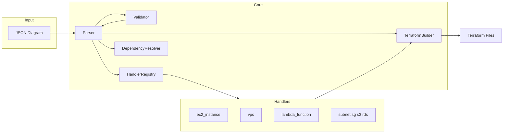

# JSON-to-Terraform Parser — Go Implementation Plan

## Scope and Assumptions

- **Output**: Flat Terraform only (no modules); all resources in `main.tf`.
- **Config**: Optional `terraform.tfvars` generated from diagram metadata; `variables.tf` always generated.
- **Language**: Go for performance, concurrency, single-binary deployment, and cloud-native tooling.
- **Out of scope initially**: Terraform backend/state config, workspaces, AWS quota validation, Terraform data sources.

---

## Why Go

- **Concurrency**: Validate and generate Terraform for independent nodes in parallel (e.g. `errgroup`, worker pool) after dependency order is known; parallel schema validation and handler execution where no data dependency exists.
- **Performance**: Native JSON (encoding/json), minimal allocations, fast execution for 50+ nodes (&lt; 2s target); single binary keeps memory footprint low.
- **Cloud-native**: Single static binary for containers (Docker, Kubernetes), CI/CD (GitHub Actions, GitLab), and server-side execution; no runtime dependency; easy integration with Terraform CLI, OpenTofu, or future operators.
- **Ecosystem**: HashiCorp HCL (hclwrite, go-cty) for correct HCL generation; standard library and small dependencies for long-term maintainability.

---

## High-Level Architecture



**Flow**: Load JSON → validate schema → resolve dependencies (edges) → topologically sort nodes → **in parallel where safe**: validate properties and generate HCL for nodes in same dependency tier → assemble files (main.tf, variables.tf, outputs.tf, versions.tf, optional terraform.tfvars).

---

## 1. Project Bootstrap

- **Go version**: 1.21+ (go.mod, standard library).
- **Module path**: e.g. `github.com/yourorg/json-to-terraform` or internal path.
- **Dependencies**: 
  - `encoding/json` (stdlib)
  - `github.com/hashicorp/hcl/v2/hclwrite` for generating HCL (canonical formatting, no syntax errors)
  - Optional: `github.com/xeipuuv/gojsonschema` or manual struct tags + validation for diagram schema
- **Layout**: Standard Go project layout; packages as below.
- **Testing**: `go test`; table-driven tests; fixtures in `testdata/` or `internal/parser/testdata/`.

---

## 2. Project Structure (Go)

```
json-to-terraform/
├── go.mod
├── go.sum
├── cmd/
│   └── parser/
│       └── main.go              # CLI entry point
├── internal/
│   ├── diagram/
│   │   ├── schema.go            # Diagram structs (metadata, nodes, edges)
│   │   ├── validate.go          # JSON schema / struct validation
│   │   └── schema.json          # Optional: embedded JSON schema
│   ├── parser/
│   │   ├── parser.go            # Main orchestrator
│   │   ├── result.go            # ParseResult (Success, Files, Errors, Warnings)
│   │   └── options.go           # Parser options (e.g. emit tfvars)
│   ├── registry/
│   │   └── registry.go          # Handler registry (map[string]Handler)
│   ├── handler/
│   │   ├── handler.go           # ResourceHandler interface
│   │   ├── vpc.go
│   │   ├── subnet.go
│   │   ├── security_group.go
│   │   ├── ec2.go
│   │   ├── lambda.go
│   │   ├── s3.go
│   │   └── rds.go
│   ├── dependency/
│   │   └── resolver.go          # Graph build, topo sort, cycle detection
│   ├── terraform/
│   │   ├── builder.go           # TerraformBuilder (collect blocks, build files)
│   │   ├── hcl.go               # Helpers using hclwrite for blocks
│   │   └── templates.go        # versions.tf, variables.tf, outputs.tf content
│   └── logger/
│       └── logger.go            # Structured logger (slog or zerolog)
├── testdata/
│   ├── single_ec2.json
│   ├── vpc_subnet_ec2.json
│   └── lambda.json
└── Makefile                     # Optional: build, test, install
```

---

## 3. Core Components

### 3.1 Diagram Model and Validation

- **`internal/diagram/schema.go`**: Structs for diagram input:
  - `Diagram` (Metadata, Nodes, Edges)
  - `Node` (ID, Type, Label, Position, Properties map or json.RawMessage)
  - `Edge` (ID, Source, Target, Type, Properties)
- **`internal/diagram/validate.go`**: Validate required fields, types, and structure; return a slice of `ValidationError` (NodeID, Message, Suggestion). Use struct tags + custom rules or gojsonschema; keep resource-specific validation in handlers.

### 3.2 Handler Interface and Registry

- **`internal/handler/handler.go`**:
  - Interface `ResourceHandler` with:
    - `ResourceType() string`
    - `Validate(node *diagram.Node) ([]ValidationError, []Warning)`
    - `GenerateHCL(node *diagram.Node, refs RefMap) ([]byte, error)` — refs = node ID → Terraform address for depends_on / attributes
  - `RefMap` type: map node IDs to resource addresses (e.g. `aws_vpc.node_3`).
  - Handlers use `hclwrite` to build blocks (no raw string concatenation for correctness).
- **`internal/registry/registry.go`**: 
  - `Registry` struct with `Register(resourceType string, h ResourceHandler)` and `Get(resourceType string) (ResourceHandler, bool)`.
  - `func init()` in each handler package to register with a default global registry, or explicit registration in `cmd/parser/main.go`.

### 3.3 Dependency Resolution

- **`internal/dependency/resolver.go`**: 
  - Build directed graph from edges (`contains` → target depends on source; `depends_on`/`connects_to` similarly).
  - Topological sort (Kahn or DFS); cycle detection; return ordered `[]string` (node IDs) and optionally dependency tiers (same tier = can run in parallel).
  - Expose `Resolve(nodes []*Node, edges []*Edge) (ordered []string, tiers [][]string, err error)`.

### 3.4 Terraform Builder and HCL

- **`internal/terraform/builder.go`**: 
  - `TerraformBuilder` holds slices of resource blocks ([]byte from handlers), variables, outputs.
  - `AddResource(block []byte)`, `SetVariables(content []byte)`, `SetOutputs(content []byte)`.
  - `Build() map[string][]byte` → filenames to content (main.tf, variables.tf, versions.tf, outputs.tf, optional terraform.tfvars).
- **`internal/terraform/hcl.go`**: Helpers using `hclwrite` to create `resource "aws_xxx" "name" { ... }`, `variable "name" { ... }`, etc., so handlers stay consistent.
- **`internal/terraform/templates.go`**: Generate versions.tf (terraform block + aws provider), variables.tf (e.g. aws_region), outputs.tf (optional); optional tfvars from diagram metadata.

### 3.5 Parser Orchestrator (with Concurrency)

- **`internal/parser/parser.go`**:
  - `InfrastructureParser` struct (options: e.g. emit tfvars, max parallel).
  - `Parse(diagram *diagram.Diagram) (*ParseResult, error)`:
    1. Validate diagram (schema/structure) — single goroutine.
    2. Resolve dependencies → ordered list and tiers.
    3. **Per tier**: run handlers in parallel with `errgroup` or worker pool: for each node in tier, get handler, validate, then generate HCL; collect errors (thread-safe slice or channel). Nodes in the same tier have no dependency on each other, so safe to parallelize.
    4. Assemble main.tf from ordered blocks, add variables.tf, versions.tf, outputs.tf, optional tfvars.
    5. Return `ParseResult`: Success, TerraformFiles (map[string][]byte), Errors, Warnings (AGENTS.md format).
- **`internal/parser/result.go`**: Structs for `ParseResult`, `Error`, `Warning` (JSON-serializable for API/CLI output).

### 3.6 Logging

- **`internal/logger/logger.go`**: Use `log/slog` (Go 1.21+) with JSON output; include context (node_id, resource_type, phase); optional metrics (parse duration, validation duration, generation duration).

---

## 4. Concurrency and Parallelism

- **Dependency tiers**: After topo sort, group node IDs by “depth” (e.g. tier 0: no deps, tier 1: depend only on tier 0, etc.). Process tier-by-tier; within each tier, run validation and HCL generation in parallel.
- **Mechanisms**: `sync.Errgroup` for “run N tasks, fail fast on first error” or a worker pool with a channel of node IDs; collect validation errors and warnings in a `sync.Mutex`-protected slice or via channels.
- **Safety**: No shared mutable state between nodes; RefMap is read-only after dependency resolution; handlers are stateless (or per-call state).
- **Benefit**: For large diagrams (50+ nodes), multiple nodes per tier can be validated and generated concurrently, reducing wall-clock time.

---

## 5. Resource Handlers (Same Semantics as Before)

- **Naming**: Node ID `node-1` → Terraform name `node_1` (sanitize in one place, e.g. `terraform.SanitizeName(id)`).
- **Edge semantics**: `contains` → child gets parent ref (e.g. `vpc_id = aws_vpc.node_3.id`); `depends_on`/`connects_to` → add `depends_on` or attribute refs.
- **Order for Milestone 1**: VPC → Subnet → Security Group → EC2 → Lambda; then S3, RDS.
- Each handler implements `ResourceHandler`; uses `hclwrite` to build one or more `resource` blocks; validates required fields and value shapes; returns structured validation errors and warnings.

---

## 6. CLI and API

- **CLI** (`cmd/parser/main.go`): 
  - Flags: input file (or stdin), output dir (`-o`), `-no-tfvars`, `-parallel` (max workers, default e.g. GOMAXPROCS).
  - Read diagram JSON → parse → write `result.TerraformFiles` to output dir; on failure print errors (JSON or human-readable) and os.Exit(1).
- **API**: `parser.New(opts).Parse(diagram *diagram.Diagram) (*parser.ParseResult, error)` for use from other Go code or future HTTP/gRPC service.

---

## 7. Cloud-Native Integration

- **Single binary**: `go build -o json2tf ./cmd/parser`; run in Docker or K8s without Python/runtime.
- **CI/CD**: Binary can read diagram from stdin or file, write Terraform to volume; easy to chain with `terraform plan`/`apply` or OpenTofu.
- **Future**: Optional Terraform executor (run `terraform init/plan/apply` in a subprocess or use Terraform Cloud API); optional HTTP server that accepts JSON diagram and returns Terraform or runs deployment.

---

## 8. Testing Strategy

- **Unit**: Each handler — table-driven tests with valid/invalid properties; compare generated HCL (bytes or parsed with hclwrite) to expected snippets.
- **Integration**: Load testdata JSON → Parse → assert expected resource count and presence of key attributes; optional: write to temp dir and run `terraform validate` (requires Terraform binary).
- **Concurrency**: Test parser with diagram that has multiple nodes in same tier; verify no data races (go test -race) and that output is deterministic.

---

## 9. Implementation Order

| Step | Component | Notes |
|------|-----------|--------|
| 1 | go.mod, diagram structs, validate (schema/structure) | Foundation |
| 2 | handler.Handler interface, registry, one stub handler | Extensibility |
| 3 | dependency resolver (graph, topo sort, tiers) | Ordering and parallel tiers |
| 4 | terraform.Builder + hcl helpers + versions/variables/outputs | Assembly |
| 5 | VPC, Subnet, Security Group handlers | Networking first |
| 6 | EC2, Lambda handlers | Compute |
| 7 | Parser orchestration + tiered parallel execution + result | Core flow |
| 8 | S3, RDS handlers | More resources |
| 9 | cmd/parser main, flags, optional tfvars | CLI |
| 10 | Tests, testdata, logger, -race and benchmarks | Quality |

---

## 10. Error Handling and Output Format

- Same as AGENTS.md: structured errors (type, severity, node_id, message, suggestion) and warnings; JSON-serializable for API/CLI.
- Validation stages: diagram schema → per-handler validation (can run in parallel within tier) → dependency errors (cycle, missing ref). Collect all errors where feasible; fail fast only where necessary (e.g. cycle).

---

## 11. Dependencies Summary (Go)

- **Standard library**: `encoding/json`, `log/slog`, `sync`, `context`.
- **HCL**: `github.com/hashicorp/hcl/v2/hclwrite` (and possibly `hcl/v2` for parsing if validating generated HCL).
- **Optional**: `github.com/xeipuuv/gojsonschema` for JSON Schema validation of diagram; otherwise validate via struct tags and custom logic.

This plan preserves the same architecture (parser, registry, handlers, dependency resolution, Terraform builder) and success criteria as the Python plan, while shifting to Go with explicit concurrency, single-binary deployment, and cloud-native-friendly design.
